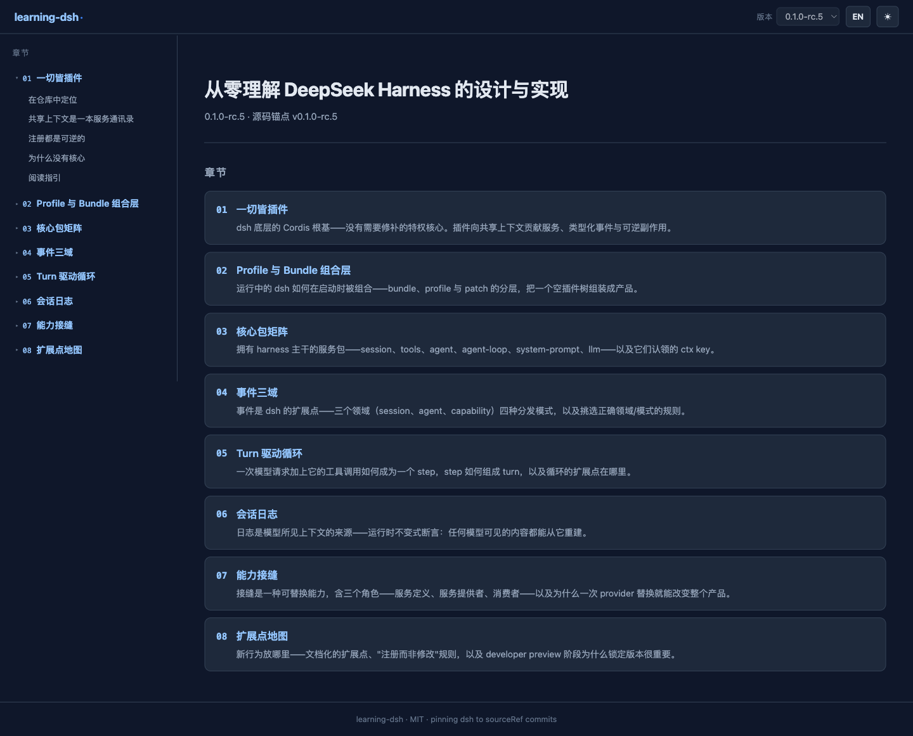
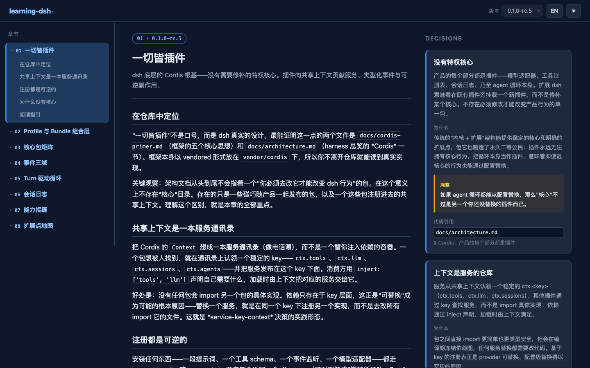
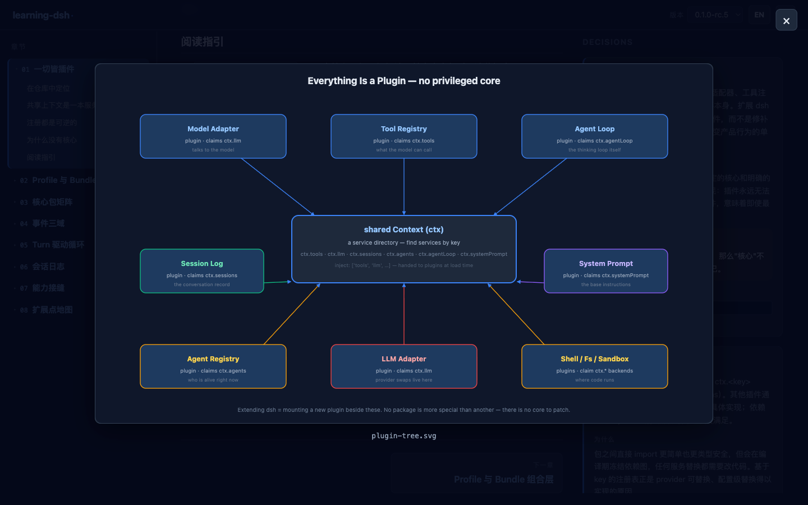
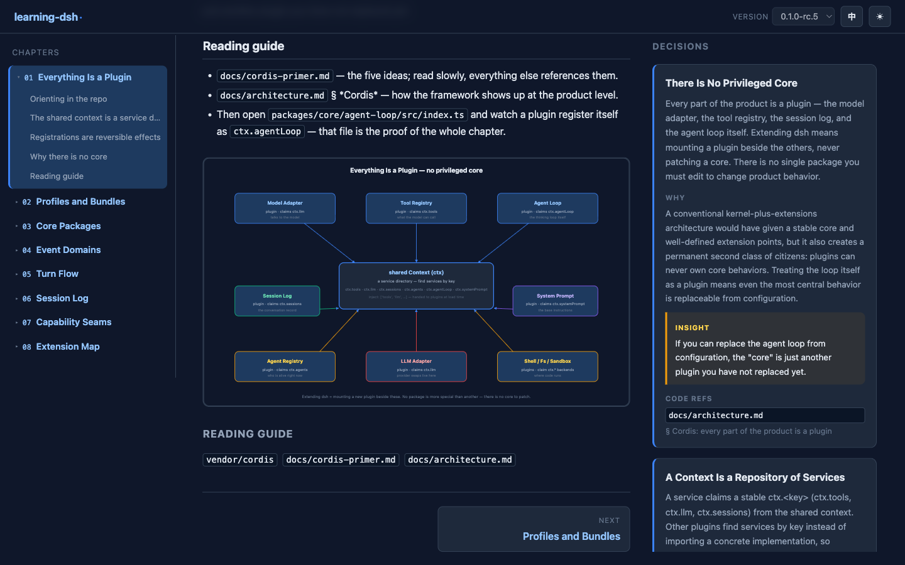
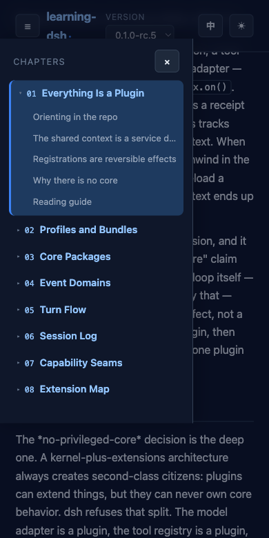

# learning-dsh

Versioned, bilingual (EN/ZH) source-code learning pages for [DeepSeek Harness](https://github.com/yangl326-Dylan/deepseek-harness) (dsh), served as a dsh plugin at a configurable prefix route (default `/learning`).

为 [DeepSeek Harness](https://github.com/yangl326-Dylan/deepseek-harness) (dsh) 提供版本化中英双语源码学习页面；以 dsh 插件形式运行，挂载在可配置的前缀路由（默认 `/learning`）上。

|  |  |
|---|---|
| 插件 Plugin | `@dylan/learning-dsh`（Cordis plugin） |
| 前端 Frontend | `@learning-dsh/web`（Vite static build） |
| License | MIT |

---

## Screenshots / 界面展示

| 首页（章节卡片 + 版本切换）/ Home | 章节页（左侧导航树 + 正文）/ Chapter |
|---|---|
|  |  |

| 架构图全屏灯箱 / Diagram lightbox | 英文界面 / English UI | 移动端抽屉导航 / Mobile drawer |
|---|---|---|
|  |  |  |

- **章节导航树** — 左侧常驻目录，展开到子章节，点击平滑滚动定位（`scroll-margin` 避开 sticky header） / Persistent sidebar tree with sub-chapter anchors and smooth scroll-to-heading.
- **架构图灯箱** — 点击图表全屏查看，按 SVG 固有比例自动适配视口，Esc/背景/按钮关闭 / Click a diagram to open a fullscreen lightbox; auto-scales to the viewport, closes via Esc/backdrop/button.
- **中英双语** — 一键切换 EN/ZH，内容与 UI 同步，locale 记忆 / One-click EN/ZH toggle, content and UI switch together, locale is remembered.
- **版本化内容** — 版本下拉选择已发布内容版本，正文锁定对应 `sourceRef` / Version dropdown; content locked to its published `sourceRef`.
- **响应式** — 窄屏下导航树变为抽屉 + backdrop / Sidebar becomes a drawer with backdrop on narrow screens.

---

## Usage / 使用方式

### Prerequisites / 前置条件

- dsh CLI available (`pnpm dsh ...` from the dsh source tree, or an installed `dsh` binary) / dsh CLI 可用（dsh 源码树下 `pnpm dsh ...`，或已安装的 `dsh` 命令）
- Node ≥ 22
- Built artifacts / 构建产物：
  ```sh
  cd packages/web && npx vite build
  cd packages/plugin && npx tsc -p tsconfig.build.json
  ```

### Option 0 — Let an AI agent install it for you / 方式 0：交给 AI agent 自行安装

Prefer to delegate the install? Paste the whole block below as the starting instruction to your AI coding agent (Claude Code, Cursor, …); the agent should clone, build, install and verify on its own. The block is self-contained, so it works even without reading the rest of this README. / 想省事？把下面整段作为起始指令交给你的 AI 编程助手（Claude Code、Cursor 等），让它自行完成克隆、构建、安装与验证。该指令块自包含，不依赖本 README 其余内容。

````markdown
You are installing the `learning-dsh` plugin into a DeepSeek Harness (dsh) profile.

1. Locate the dsh checkout — the directory where `pnpm dsh ...` works (an installed `dsh` binary also works). Pick the target profile (default `web`); ask the user if ambiguous. Require Node ≥ 22.
2. Prepare the plugin repo in a scratch directory:
   ```sh
   git clone https://github.com/yangl326-Dylan/learning-dsh.git /tmp/learning-dsh
   cd /tmp/learning-dsh && pnpm install
   ```
3. Build content, frontend and plugin, in this order:
   ```sh
   npx tsx scripts/build-content.ts                  # content JSON -> packages/web/public/data
   cd packages/web && npx vite build                 # frontend dist
   cd ../plugin && npx tsc -p tsconfig.build.json    # plugin lib
   ```
4. Install into the profile:
   ```sh
   pnpm dsh plugin --profile <profile> add /tmp/learning-dsh/packages/plugin
   ```
5. Verify the composed config without booting — expect a `# == @dylan/learning-dsh` layer:
   ```sh
   pnpm dsh --profile <profile> --dump-config
   ```
6. Boot a fresh instance and confirm the learning page answers with HTTP 200:
   ```sh
   pnpm dsh --profile <profile> --port 3080
   curl -s -o /dev/null -w '%{http_code}\n' http://127.0.0.1:3080/learning/
   ```
7. If the user prefers no profile change, skip steps 4–5 and load the ready overlay instead:
   ```sh
   pnpm dsh --profile <profile> --patch /tmp/learning-dsh/scripts/learning-dsh.patch.yml --port 3099
   ```

Keep the monorepo `node_modules` of the checkout intact — the plugin locates the frontend dist via `require.resolve('@learning-dsh/web')`. Don't move or delete `/tmp/learning-dsh` afterwards without telling the user. Report the profile used, the verified URL, and any step that failed; leave the environment (running instance, scratch dir) as the user prefers.
````

### Option A — Install as a bundle (recommended) / 方式 A：作为 bundle 安装（推荐）

The plugin package ships a `dsh.bundle` layer (`cordis.patch.yml`), so it installs into a profile exactly like any other dsh bundle. From the dsh source tree / 插件包自带 `dsh.bundle` 配置层（`cordis.patch.yml`），可与任意 dsh bundle 一样安装进 profile。在 dsh 源码树下执行：

```sh
pnpm dsh plugin --profile web add /path/to/learning-dsh/packages/plugin
```

What happens / 效果：

1. pnpm links the package into the profile (`~/.dsh/profiles/web/node_modules`) / pnpm 将包链接进 profile
2. Because the manifest declares `dsh.bundle.patch`, `dsh` appends `@dylan/learning-dsh` to `dsh.profile.bundles` / 因 manifest 声明了 `dsh.bundle.patch`，`dsh` 自动将 `@dylan/learning-dsh` 追加到 `dsh.profile.bundles`
3. Restart your dsh instance (or boot a fresh one) / 重启 dsh 实例（或启动新实例）：

```sh
pnpm dsh --profile web --port 3080
```

4. Open the learning page / 打开学习页面：<http://127.0.0.1:3080/learning/>

Verify the composed tree without booting / 不启动即可验证组合配置：

```sh
pnpm dsh --profile web --dump-config   # look for the "# == @dylan/learning-dsh" layer
```

Remove / 卸载：

```sh
pnpm dsh plugin --profile web remove @dylan/learning-dsh
```

### Option B — Load with a `--patch` overlay (no profile change) / 方式 B：`--patch` 覆盖加载（不改 profile）

Good for a quick trial without touching your profile / 适合不想改动 profile 的快速试用。The repo ships a ready overlay / 仓库已提供现成覆盖文件 `scripts/learning-dsh.patch.yml`:

```sh
pnpm dsh --profile web --patch /path/to/learning-dsh/scripts/learning-dsh.patch.yml --port 3099
```

Open / 打开 <http://127.0.0.1:3099/learning/>. Nothing is written to the profile; drop the `--patch` flag to go back / 不写入 profile；去掉 `--patch` 参数即恢复原状。

### Configuration / 配置

The plugin row can be overridden in `cordis.patch.yml` by `id: learning-dsh` / 插件行可在 `cordis.patch.yml` 中按 `id: learning-dsh` 覆盖：

```yaml
- id: learning-dsh
  config:
    mountPath: /learning   # prefix route / 挂载前缀，默认 /learning
    title: Learning dsh    # page title baked into served index.html / 页面标题
```

### Notes / 注意事项

- **Mount path must be unique** — the plugin registers a `prefix` route on the dsh webserver; a duplicate `mountPath` fails loudly / **挂载路径必须唯一**——插件在 dsh webserver 上注册 `prefix` 路由；重复的 `mountPath` 会直接报错。
- **The webserver fallback seat belongs to the dsh web app** — paths outside your `mountPath` keep serving the dsh UI / **webserver 的 fallback seat 归 dsh web app 所有**——`mountPath` 之外的路径仍由 dsh 主界面服务。
- **Service-name compatibility** — the plugin auto-detects the host webserver service: `ctx.httpServer` (published `@deepseek-ai/dsh-host-webserver@0.0.1-rc.1`) or `ctx.webServer` (master source). No configuration needed / **服务名兼容**——插件自动识别宿主 webserver 服务：`ctx.httpServer`（npm 发布版）或 `ctx.webServer`（master 源码），无需配置。
- **`@learning-dsh/web` must be resolvable from the plugin package** — the plugin locates the frontend dist via `require.resolve('@learning-dsh/web')`; in this repo it is a workspace devDependency, so keep the monorepo `node_modules` intact when running from the checkout / **`@learning-dsh/web` 需可从插件包解析**——插件通过 `require.resolve('@learning-dsh/web')` 定位前端 dist；本仓库中它是 workspace devDependency，从源码运行时请保留 monorepo `node_modules`。

---

## Repository layout / 仓库布局

```
content/            版本化双语内容源（YAML + body.md + SVG）
docs/               spec 驱动文档（contract / feature / spec）— 中文
packages/web        Vite 静态前端（@learning-dsh/web）
packages/plugin     dsh Cordis 插件（@dylan/learning-dsh）
scripts/            内容构建管线（build-content.ts）
```

## Development / 开发

```sh
pnpm install                       # workspace 安装
npx tsx scripts/build-content.ts   # 构建内容数据 -> packages/web/public/data
cd packages/web && npx vite build  # 构建前端 dist
cd packages/plugin && npx tsc -p tsconfig.build.json   # 构建插件 lib
cd packages/plugin && node e2e/verify.mjs              # 独立 E2E（真实 Cordis + webserver + 插件）
```

Docs / 文档：[docs/README.md](docs/README.md)
